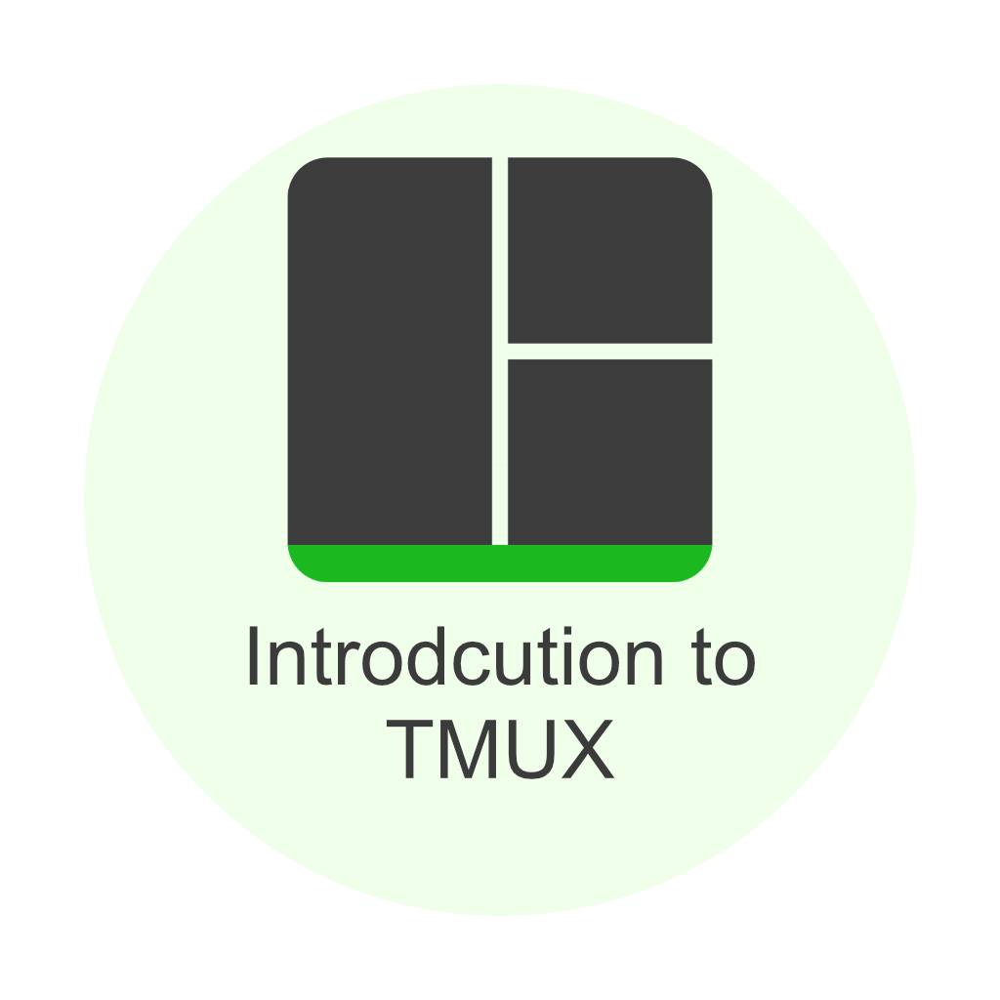

  <a href="https://kir-rescomp.github.io/kir-training-home/">← Return to KIR Training Catalogue</a>

<h1></h1>

    

!!! info ""

    This lesson provides a quick introduction to **tmux**, a terminal multiplexer that allows you to manage persistent terminal sessions on HPC clusters. Learn how to create detachable sessions, work with multiple panes, and keep your work running even when SSH disconnects.

!!! calendar-days "Content"

    1. [Introduction to tmux](./1.introduction-to-tmux.md)
        - What is tmux and why use it on clusters?
        - Essential commands and workflows
        - Working with panes
        - Practical HPC examples with Slurm
